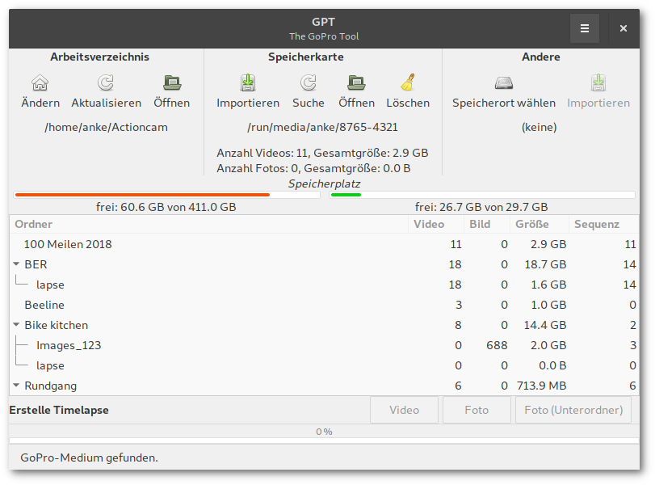
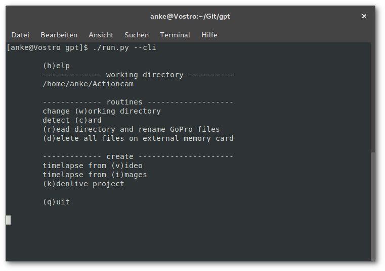

### WHAT IS THIS?

- a simple tool for organizing your GoPro stuff

### WHAT IS IT NOT?

- a video editor
- professional

### TELL ME ABOUT FEATURES!

- import your stuff from SD card
- rename files in a more logical order than according to the GoPro naming convention
- keep an eye on your footage, directly rename folders
- create timelapse videos from your stuff via FFmpeg
- localization: English, German
- open folder content as Kdenlive project
- extended application window with fancy video preview and media information (requires GStreamer and MediaInfo)

### YOU MUST BE JOKING!

- well, these are the basic tasks I usually perform before doing the video editing in Kdenlive (use it, it's great)
- I'm thinking about polishing and new features but no warranty that this will get any better

### WHAT DO I NEED TO GET IT WORKING?

 * Python 3
 * Python GObject Introspection bindings ([PyGObject](http://pygobject.readthedocs.io/en/latest/getting_started.html))
 * [PyYAML](https://github.com/yaml/pyyaml)
 * [lxml](https://lxml.de/)
 * recommended: Git (it's probably already installed)
 * if you plan an installation: [setuptools](https://github.com/pypa/setuptools)
 * FFmpeg (optional)
 * [GStreamer](https://gstreamer.freedesktop.org/) and [MediaInfo](https://mediaarea.net/MediaInfo) (optional) for the extended application window
 * GoPro camera...

### INSTALLATION

 * download and extract or clone repository and change into said folder
 
> FTR: when executing `python`, it is Python 3

The PyGObject Introspection bindings are probably already installed (tested with a plain Openbox and MATE desktop). You can install dependencies from the repositories:

#### PREPARE ARCHLINUX AND ITS RELATIVES

``` bash
$ sudo pacman -S python-gobject python-yaml python-setuptools python-lxml python-setproctitle mediainfo ffmpeg
```

#### PREPARE UBUNTU 18.04 LTS

``` bash
$ sudo apt-get install python3-gi python3-setuptools python3-lxml gir1.2-gtk-3.0 gir1.2-gstreamer-1.0 gstreamer1.0-gtk3 mediainfo ffmpeg
```

### ARE WE THERE YET?

 * change into the `herostuff` folder and execute `run.py`
 * if you intend to use the desktop icon, edit `data/GPT.desktop` and customize path of "Exec", and "Icon" and copy file to `~/.local/share/applications/`

### I'M LAZY!

 * run `python setup.py install --user` to install the app just for the current user or
 * run `python setup.py build` and then `python setup.py install` with administrator privilege for system-wide installation
 * press the <kbd>SUPER</kbd> key and start typing <kbd>G</kbd>...<kbd>P</kbd>...<kbd>T</kbd>...<kbd>ENTER</kbd>

### HOW DO I GET RID OF THIS?

 * Lucky you asked. If you installed the application via `setup.py`, run `python setup.py uninstall --user` or `python setup.py uninstall` (with superuserpowers) to undo the installation. This will remove the Python package and any desktop files. If not just delete the downloaded and extracted archive or the cloned repository.

### HOW DO I LAUNCH IT?

* execute `run.py` from a terminal or application starter, this will load the default application window with media preview
* these commandline options are available (run `run.py --help`:

```txt
  -v, --version               Show version info
  --default                   Default GUI with integrated view switch
  -c, --alt-gui-compact       Alternative GUI, compact view
  -e, --alt-gui-ext           Alternative GUI, extended view (GStreamer preview)
  --cli                       Commandline interface
  -t, --tl-calc               Run the timelapse calculator
```

If you have installed the application you can run GPT from the menu. The available options are accessible as desktop actions so you can also launch these from the GNOME shell application overview or dash.

### I HAVE SOME IDEAS.
### YOUR CODE NEEDS SOME IMPROVEMENTS.
### YOU SPELLED XYZ WRONG!

- feel free to contact me or file an issue but be patient I'm a bloody rookie

### SCREENSHOTS!

#### Default application window


#### Compact view



#### CLI



### SOURCES AND LICENSES

* application: [GNU General Public License v3](LICENSE.md)
* icon: [Action camera by Green](https://thenounproject.com/term/action-camera/207962/) from the [Noun Project](https://thenounproject.com/), licensed under [Creative Commons Attribution (CC BY)](https://creativecommons.org/licenses/by/3.0/)